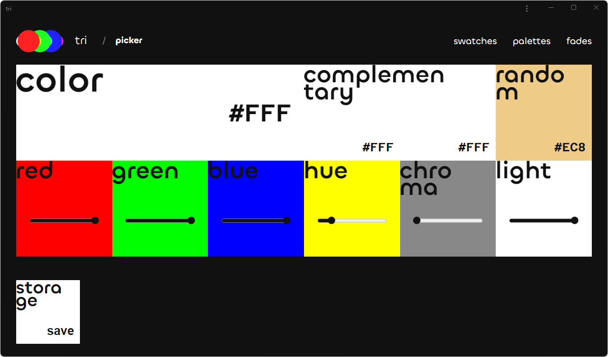

<h1 align="center">
    tri
</h1>

    <strong>A color tool for three character hexadecimal codes.</strong>

    
    

## Features

The app features a color picker to help you find the perfect color for your
project, as well as a color storage to save your selections. Also it features a
selection of already-chosen and harmonized colors to make your work easier.

If the slightest variances don't cause you too much trouble, this tool is ideal
for you whether you're a designer, developer, or just searching for a quick way
to pick colors.

Additionally, the app is a Progressive Web App (PWA) which allows users to
access it offline. This means that even without an internet connection, you can
still access the tool.

### Accessibility

W3C developed the WCAG2 set of international guidelines to make digital content
better accessible to those with disabilities. Three grades of conformance (A,
AA, and AAA) based on perceivability, operability understandability, and
robustness.

- **A**: Good for large text
- **AA**: Good for small text and Excellent for large text
- **AAA**: Excellent for small text

## Check it out

Here is the following link to
[see it online](https://color.lucianofelix.com.br).

## LICENSE

This project is [MIT Licensed](LICENSE)!
