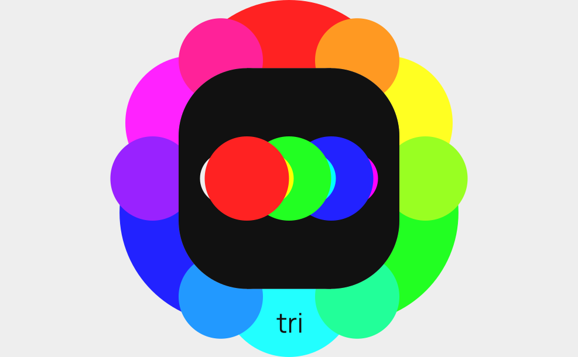
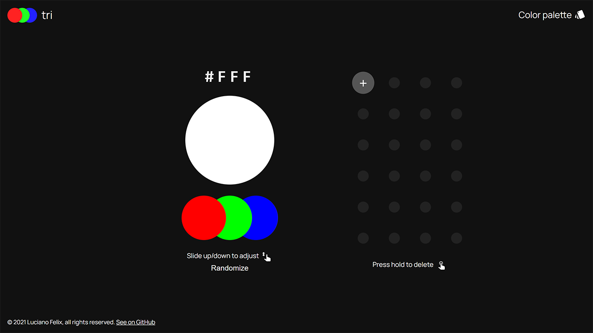
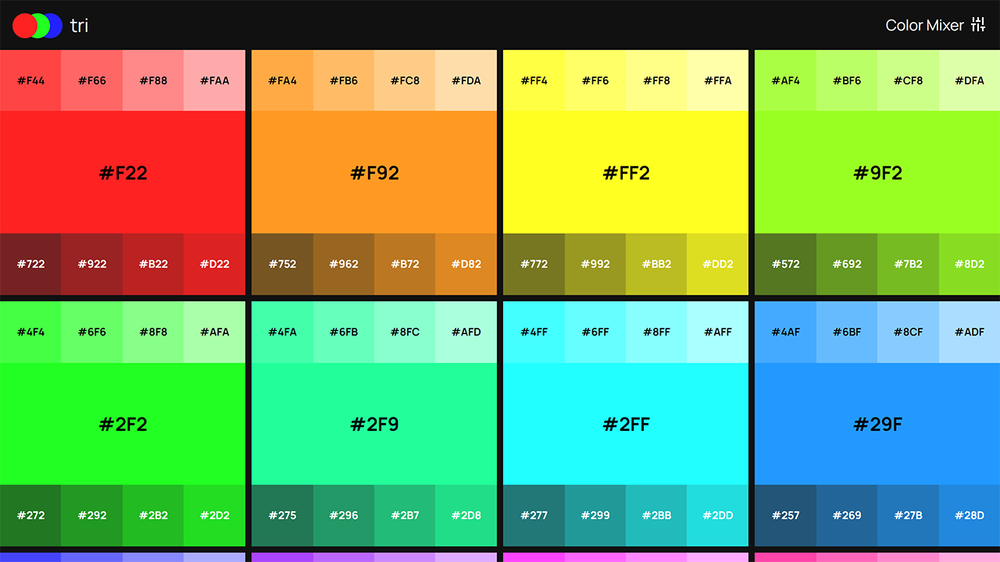
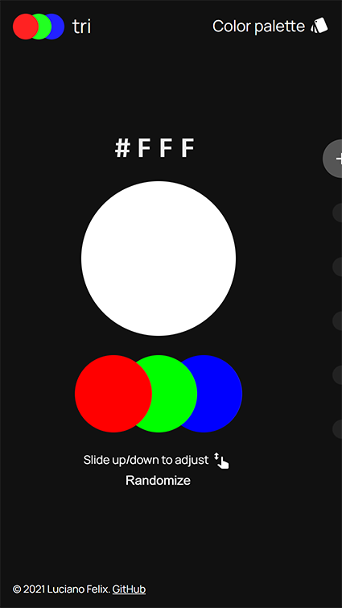
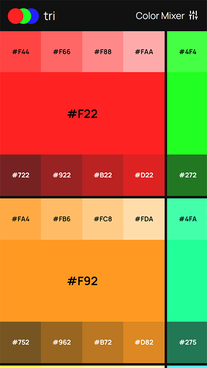
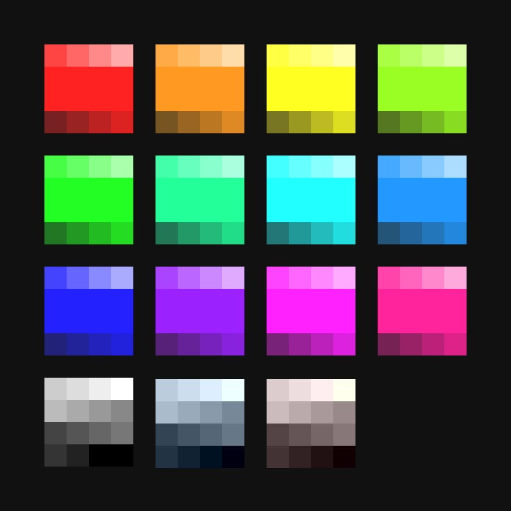

## Introduction

**tri** is a three characters hexadecimal color system.

## The app

### Desktop

### Mobile

## Color palette

[LICENSE](https://github.com/FelixLuciano/tri/blob/master/LICENSE)

Copyright © 2021 Luciano Felix
