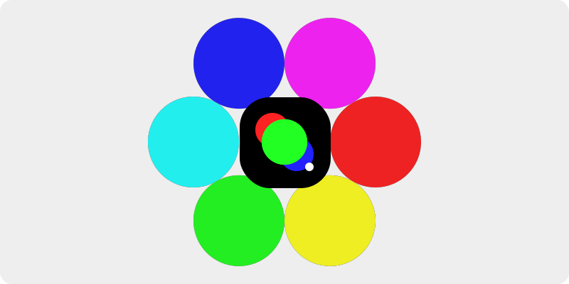
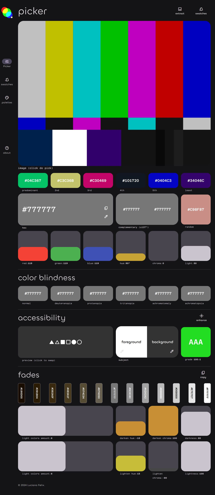

<h1 align="center">
    tri
</h1>

    <strong>A color tool for three character hexadecimal codes.</strong>

    

## Features

The app features a color picker to help you find the perfect color for your
project, as well as a color storage to save your selections. Also it features a
selection of already-chosen and harmonized colors to make your work easier.

If the slightest variances don't cause you too much trouble, this tool is ideal
for you whether you're a designer, developer, or just searching for a quick way
to pick colors.

## Check it out

Here is the following link to [see it online](https://github.lucianofelix.com.br/tri/).

## LICENSE

This project is [MIT Licensed](LICENSE)!
